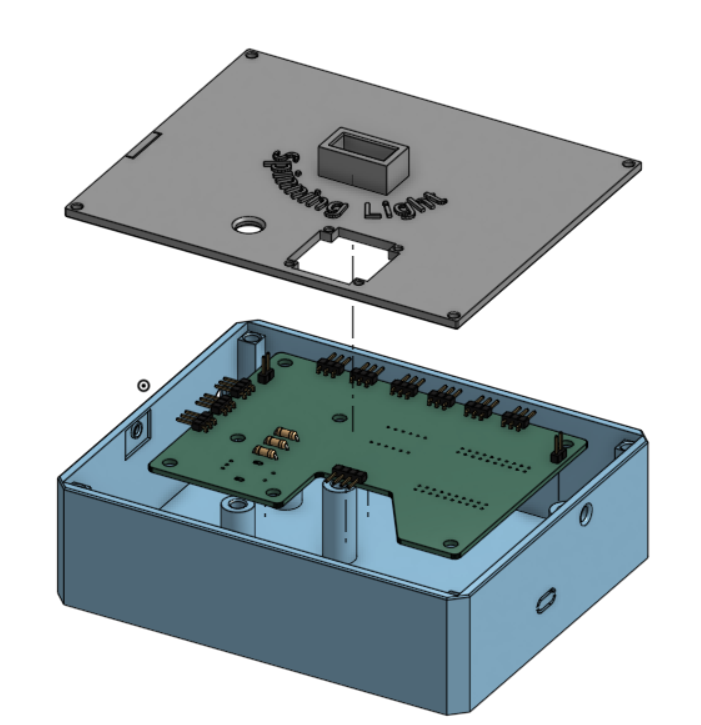

# Spinning Light
___
This project aims to bring gaming RGB and and spinning bikes to your home trainer. The lamp pairs with the Power trainer and maps the power to its LEDs. The color corresponds to the zones based on the set FTP value. When sprinting the LEDs show this by randomly turning red and yellow to add motivaition to you pain cave. 
All parameters such as the brightness of the LEDs, the FTP value and the power trainer BT adress can be changed via the GUI. Under Advanced settings, the parameters on the zone percentages, the filter constants for the LEDs and the amount of pixels can be changed. 
___
On the main screen, the sensor data for humidity and temperatre is displayed, on the second page the current power and on the third is the bluetooth adress and the power trainers name displayed. 

# Casing 

 
